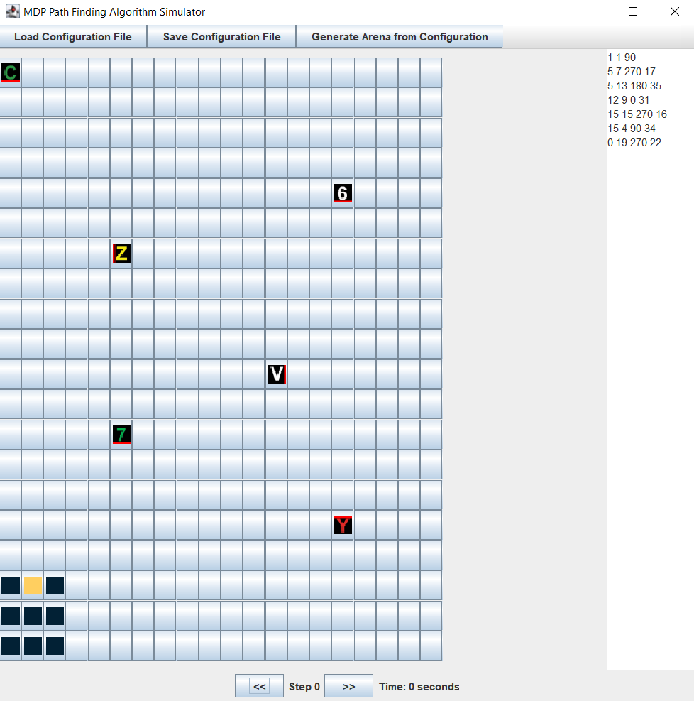

# Path Finding Algorithm

These are the instructions for running the algorithm for the MDP task

## Visualise the path using GUI (Checklist component)

1. Clone this repo, compile and run `Simulator.java`
2. You will see a pop up window
3. Copy and paste the following onto the right most text box
    ```
    1 1 90
    5 7 270 17
    5 13 180 35
    12 9 0 31
    15 15 270 16
    15 4 90 34
    0 19 270 22
    ```
    This is the configuration file

    The first line represents [robot X coordinate, robot Y coordinate, robot direction]

    The subsequent lines reprsent [obstacle x coordinate, obstacle y coordinate, obstacle direction, obstacle photo id]

    


4. Click on the **Generate Arena From Configuration Button**
5. You should see (or may not see depending on how you placed the obstacles) a sample of the arena
6. Click the front and back arrows to see how the robot moves. Note that it does not capture diagonal movements well

## Socket Connection (Task 1 and 2)

1. Ensure that the Raspberry PI server is running first
2. Configure your address and port of where you want to connect to
   ```java
   String address = "192.168.12.1";
   int port = 10003;
   AlgoServer.algoServer(address, port);
   ```
3. Compile and run `Server.java`
4. You can send messages to the server via the command line
5. You will also receive messages sent from the server

### Additional Tip
Socket connections were tested without the need for RPI by downloading [this TCP/IP tool onto a smartphone device](https://play.google.com/store/apps/details?id=jp.gr.java_conf.tcp_udp_testtool&gl=US)